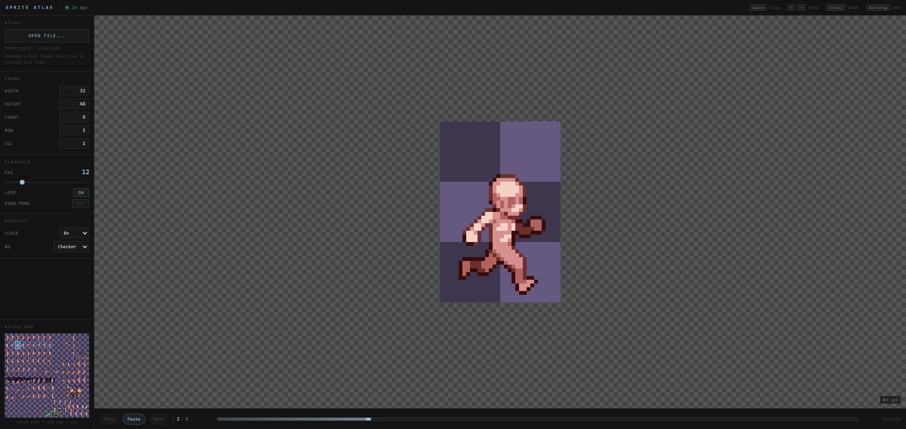

# Sprite Atlas Viewer



Live: [lazbean.github.io/sprite-atlas-viewer](https://lazbean.github.io/sprite-atlas-viewer/)

Minimal web viewer for sprite sheet animation preview.

It is made for a simple pixel-art workflow:

- draw in Photoshop
- save atlas with `Ctrl+S`
- keep the viewer open on a second screen
- see the animation update almost instantly

## Features

- browser image formats, PSD, and Aseprite loading
- live file watching via File System Access API in supported browsers
- Google Drive open + polling-based live reload
- frame width / height / count / row / column controls
- FPS control
- minimap for quick row and column picking
- saved last-used settings
- GitHub Pages friendly deployment

Aseprite files are flattened into a horizontal frame strip automatically, and the viewer sets frame width, frame height, and frame count from the file.

## Browser Note

For full live-watch behavior, use a Chromium-based browser such as Chrome or Edge.

Firefox and Safari can still open and preview files, but they do not get the same auto-reload-after-save workflow. In those browsers, after saving the file in your editor, you need to pick the file again.

GitHub Pages works fine for hosting the app, but local file watching still depends on browser support and permissions.

## Local Dev

```bash
npm install
npm run dev
```

## Google Drive Setup

To enable `Open from Drive...`, create a `.env` file with:

```bash
VITE_GOOGLE_DRIVE_CLIENT_ID=your-client-id.apps.googleusercontent.com
VITE_GOOGLE_DRIVE_API_KEY=your-browser-api-key
VITE_GOOGLE_DRIVE_APP_ID=your-google-cloud-project-number
```

In Google Cloud, enable both `Google Drive API` and `Google Picker API`, and add your local/dev and production URLs to the OAuth web client's authorized JavaScript origins.

The Google Drive integration uses OAuth + Google Picker for file selection and checks for file updates every few seconds using Drive metadata.
